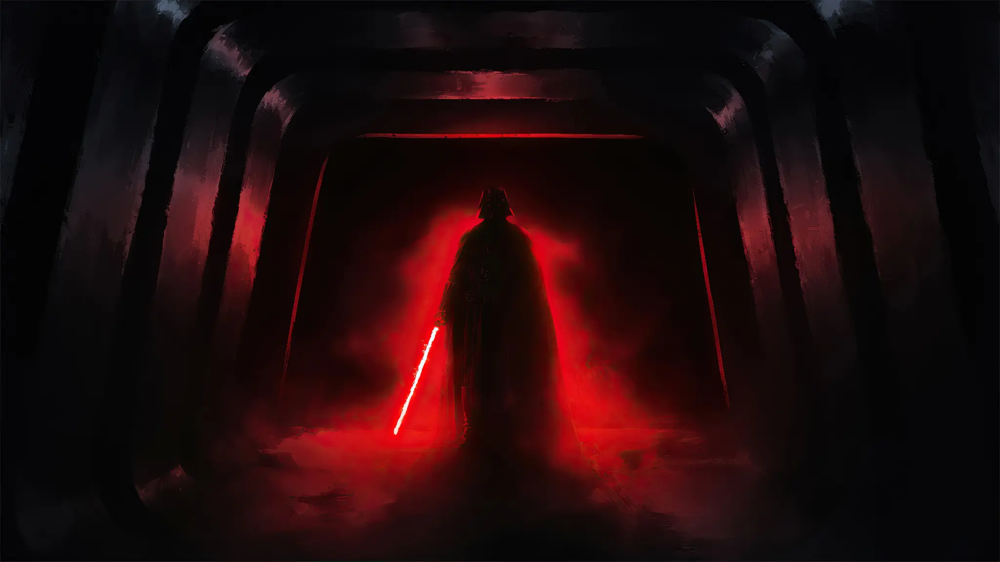
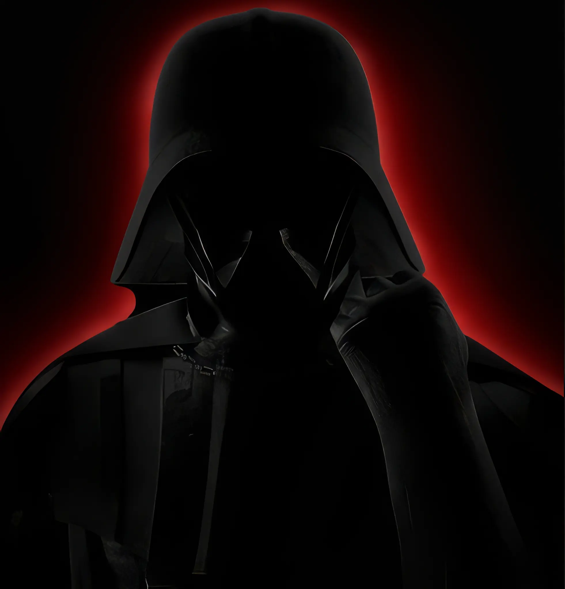

  
  <h1>O IMPÉRIO DIGITAL DE KRANUS</h1>
  
<strong>"O medo atrai os que têm poder. O poder atrai os que têm medo."</strong>

---

## 🌑 O LADO SOMBRIO DO CÓDIGO

Saudações. Este é o domínio de **KRANUS**, um Engenheiro de Software em formação e um estudante dedicado à arte da programação. Aqui, a Força é canalizada através de linhas de código, e a disciplina do Lado Sombrio é a chave para a excelência e o domínio tecnológico.

Minha jornada é de **Aprimoramento Contínuo do Código e Expansão do Domínio Digital.** Cada projeto é um passo em direção à Ordem e à perfeição algorítmica.

---

## ⚔️ ARSENAL DE PODER (TECNOLOGIAS)

O poder de um Lorde Sith reside em seu controle sobre a Força. Meu controle reside neste arsenal de tecnologias, forjadas para a conquista e a construção de sistemas robustos:

| Categoria | Tecnologias Dominadas |
| :--- | :--- |
| **Linguagens de Comando** | Java, Python |
| **Arquitetura da Base** | HTML5, CSS3 |
| **Foco Principal** | Engenharia de Software, Desenvolvimento e Estudo Contínuo |

---

## 📊 O PODER DO IMPÉRIO (ESTATÍSTICAS)

  

---

## 🌌 PROJETOS DE CONQUISTA

Este repositório serve como o meu campo de treinamento e o arquivo de minhas conquistas. Explore os projetos para testemunhar a aplicação da disciplina Sith no desenvolvimento de software.

*   **[Nome do Projeto 1]**: [Breve descrição do projeto e seu objetivo de domínio.]
*   **[Nome do Projeto 2]**: [Breve descrição do projeto e seu objetivo de domínio.]
*   **[Nome do Projeto N]**: [Adicione mais projetos conforme o seu império digital se expande.]

---

  
  
<strong>"A Força é forte em mim. Eu sou um com a Força, e a Força é uma comigo."</strong>

<!--
Nota: As imagens darth_vader_hall.png e darth_vader_close.png foram fornecidas pelo usuário e movidas para o diretório raiz do repositório para serem exibidas aqui.
-->
